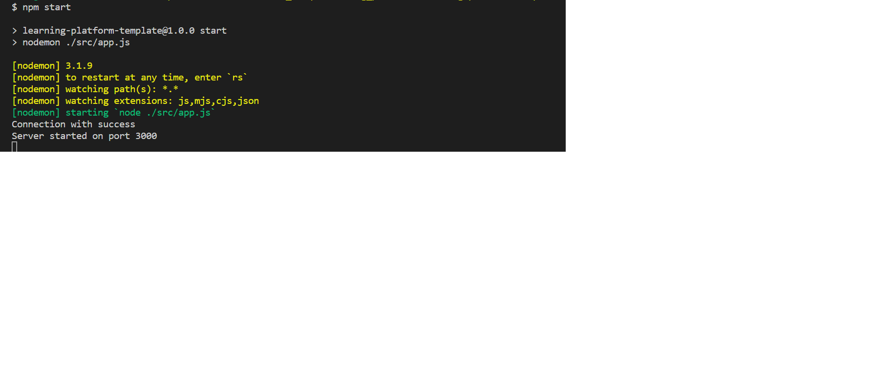
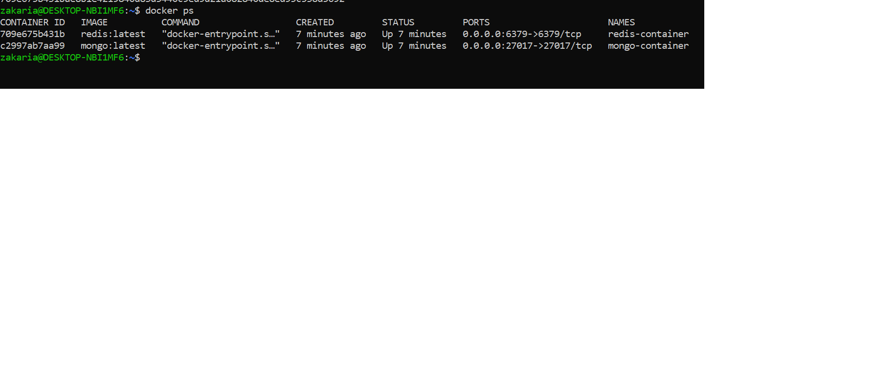
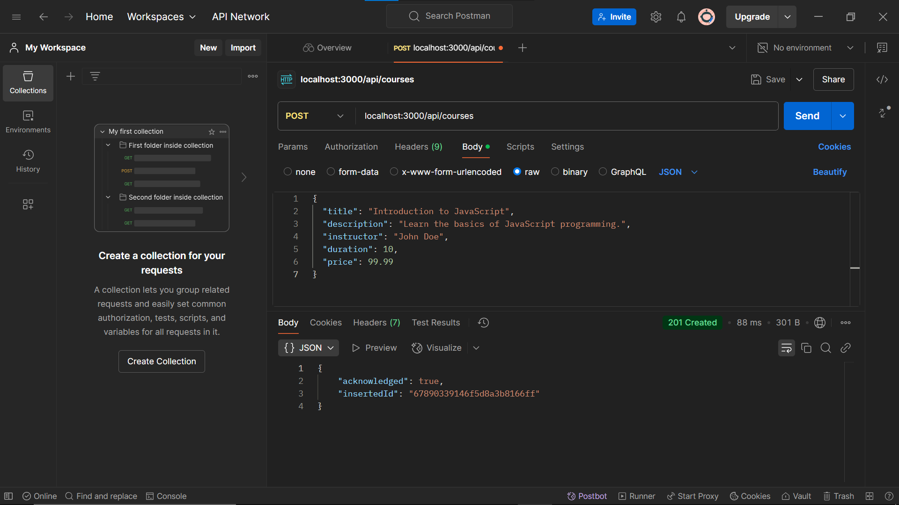

# Learning Platform 

A backend API for CRUD operations of managing a Learning Platform

## Project Structure
-  `config/`: Management of database connections (MongoDB, Redis) and environment variables.
- `controllers/`: used for business logic for entities.
- `routes/`: API entry points for each resource.
- `services/`: Services for handling business operations and interactions between different components.
- `app.js`: Main entry point.


## Installing and launching the Project en
Here are the steps to install and launch the Project :

1. **Clone the repository** :
   ```bash
   git clone https://github.com/ZakariaOuakrim/learning-platform-nosql

2. **Launch the Project** :
    ```bash 
    npm start
## Answers of technical questions in French
**Comment organiser le point d'entrée de l'application ?**
-   Organisez le point d'entrée de l'application en regroupant les différentes parties du code, en les initialisant et en les démarrant de manière ordonnée et cohérente
**Quelle est la meilleure façon de gérer le démarrage de l'application ?**
-   La meilleure façon de gérer le démarrage de l'application est de séparer les différentes étapes de l'initialisation, de gérer les erreurs de manière appropriée et de démarrer le serveur de manière asynchrone.
**Quelles sont les bonnes pratiques pour les clés Redis ?**
-   Utiliser des noms de clés explicites , Adopter une convention de nommage cohérente, limiter la longueur des clés, Utiliser des TTL (Time-to-Live) appropriés.
**Pourquoi créer des services séparés ?**
-   créer des services séparés permet de construire des applications plus modulaires, réutilisables, scalables, maintenables, et sécurisées, tout en facilitant le développement parallèle et l'isolation des pannes.
**Pourquoi séparer les routes dans différents fichiers ?**
-   En séparant les routes dans différents fichiers, vous pouvez améliorer l'organisation, la maintenabilité, la collaboration, la réutilisabilité, la scalabilité et l'isolation des composants de votre application. Cela rend le développement plus efficace et le code plus propre et plus facile à gérer.
**Comment organiser les routes de manière cohérente ?**
-   Séparer les Routes par Fonctionnalité ,Utiliser une Convention de Nommage Consistante, structurer les Routes de Manière Hiérarchique 
**Quelle est la différence entre un contrôleur et une route ?**
-   Un contrôleur est responsable de la logique métier de l'application, tandis qu'une route est responsable de l'acheminement des requêtes HTTP vers les contrôleurs appropriés.
**Pourquoi séparer la logique métier des routes ?**
-   Séparer la logique métier des routes permet de rendre le code plus modulaire, plus facile à maintenir et à tester, et de faciliter la réutilisation de la logique métier dans différentes parties de l'application.
## Demo






## Authors

- [@ZakariaOuakrim](https://www.github.com/ZakariaOuakrim)

